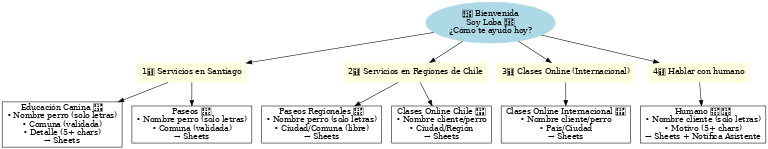

# Loba Bot – WhatsApp Cloud API (FastAPI)

Asistente virtual para **Educadora Canina Chile**. Atiende consultas por WhatsApp con menú interactivo, valida datos y guarda respuestas en **Google Sheets**. Incluye derivación a humano.

## 📊 Flujo del Bot

Este es el flujo conversacional para **Santiago**, **Regiones de Chile** y **Otros países**:



## ✨ Funcionalidades
- Menú inicial con **List Messages** (WhatsApp interactivo con descripciones y emojis).
- Flujos diferenciados:
  - **Santiago** → Educación Canina / Paseos.
  - **Regiones** → Paseos Regionales / Clases Online (Chile).
  - **Otros países** → Clases Online (Internacional).
- **Validaciones**:
  - Nombre (perro/cliente): solo letras (incluye tildes y espacios).
  - Comuna (Santiago): validada contra listado.
  - Detalle/Motivo: mínimo 5 caracteres.
- **Sheets**: escritura de registros por flujo.
- **Derivación a humano**: notificación automática al número del asistente.

## 🔧 Requisitos
- Python 3.10+
- Cuenta de **Meta for Developers** con WhatsApp Cloud API habilitada.
- Google Sheet + **Apps Script WebApp** para recibir POST.

## 🧩 Variables de entorno (`.env`)
Crea un archivo `.env` basándote en `.env.example`:

```
VERIFY_TOKEN=token-bot-wsp
WHATSAPP_TOKEN=YOUR_WHATSAPP_ACCESS_TOKEN
PHONE_NUMBER_ID=YOUR_PHONE_NUMBER_ID
SHEETS_WEBAPP_URL=YOUR_SHEETS_WEBAPP_URL
ASISTENTE_NUMERO=569XXXXXXXX
```

> En producción (Render), define estas variables en **Dashboard → Environment**.

## ▶️ Correr en local

```bash
pip install -r requirements.txt
uvicorn app:app --host 0.0.0.0 --port 8000 --reload
```

Expón el webhook con **ngrok** (opcional para pruebas locales):

```bash
ngrok http 8000
```

Configura en Meta Developers el **Webhook URL**:
```
https://TU-DOMINIO/webhook
```
y usa `VERIFY_TOKEN` para verificar.

## ☁️ Deploy en Render (CI/CD)
1. Sube este repo a GitHub.
2. En Render: **New → Web Service → Connect repo**.
3. Build Command:
   ```bash
   pip install -r requirements.txt
   ```
4. Start Command:
   ```bash
   uvicorn app:app --host 0.0.0.0 --port 10000
   ```
5. Configura variables de entorno en **Environment**.
6. Render redeploya automáticamente en cada `git push` a `main`.

## 📝 Apps Script (Google Sheets)

Ejemplo mínimo de `doPost`:

```javascript
function doPost(e) {
  var ss = SpreadsheetApp.getActiveSpreadsheet();
  var sheet = ss.getSheetByName("Hoja 1");
  var data = JSON.parse(e.postData.contents);
  sheet.appendRow([
    new Date(),
    data.nombre || "",
    data.comuna || "",
    data.detalle || "",
    data.servicio || "",
    data.numero || ""
  ]);
  return ContentService.createTextOutput("OK");
}
```

## 🔒 Buenas prácticas
- Usa un **token permanente** (System User en Business Manager).
- No subas `.env` reales; usa `.env.example`.
- Maneja errores 401 (token expirado) con logs y alerta.

---

© 2025 Educadora Canina Chile
